<!-- Custom vector artwork is maintained in assets/. All essential information also appears as text below. -->

  <a href="https://s-u.in/"><b>PORTFOLIO ↗</b></a>
  &nbsp;&nbsp;&nbsp; / &nbsp;&nbsp;&nbsp;
  <a href="#selected-work"><b>SELECTED WORK</b></a>
  &nbsp;&nbsp;&nbsp; / &nbsp;&nbsp;&nbsp;
  <a href="#workbench"><b>WORKBENCH</b></a>
  &nbsp;&nbsp;&nbsp; / &nbsp;&nbsp;&nbsp;
  <a href="mailto:Shelvinjoe11@gmail.com"><b>GET IN TOUCH ↗</b></a>

 

I'm **Katongole Shelvin Joel**, a full-stack developer based in **Uganda**. I work with React and TypeScript, alongside PHP, MySQL, WordPress, and Linux. My focus is practical web applications; right now, I'm learning more about system design, performance, and clean architecture.

 

**[MovieBay ↗](https://github.com/Katongole2005/movie-bay)** · A public media application built with React, TypeScript, Vite, Tailwind CSS, and Supabase. Its source includes browsing and search routes, authentication, profiles, and an admin area.

Inside the project

 

| Layer | In the repository |
| :--- | :--- |
| Interface | React, TypeScript, Tailwind CSS, Radix UI |
| Navigation | React Router; movie, series, search, profile, and admin routes |
| Data &amp; accounts | Supabase integration, authentication context, TanStack Query |
| Development | Vite, Vitest, Testing Library, ESLint |

[Browse the source](https://github.com/Katongole2005/movie-bay) · [See package.json](https://github.com/Katongole2005/movie-bay/blob/HEAD/package.json)

 

More about my tools and interests

 

I use **React and TypeScript** for frontend work, **PHP and MySQL** for web systems, and **WordPress and Linux** across sites and their environments.

I also explore Python, React Native, Docker, and deployment tooling. My current learning priorities are **system design**, **performance**, and **clean architecture**.

 

  <a href="https://s-u.in/">Portfolio</a>
  &nbsp; / &nbsp;
  <a href="mailto:Shelvinjoe11@gmail.com">Email</a>
  &nbsp; / &nbsp;
  <a href="https://github.com/Katongole2005?tab=repositories">Public repositories</a>
    
  KATONGOLE SHELVIN JOEL &nbsp;·&nbsp; UGANDA, UTC+3

