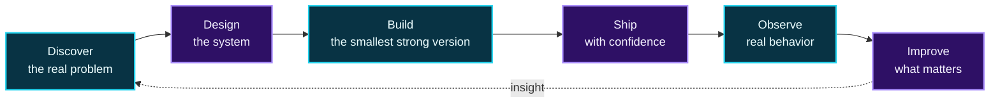

<div align="center">



<br />

[](https://s-u.in/)
[](mailto:Shelvinjoe11@gmail.com)
[](https://github.com/Katongole2005)

<br />

<a href="#01--about-me">About</a>&nbsp;&nbsp;•&nbsp;&nbsp;
<a href="#02--engineering-toolbox">Toolbox</a>&nbsp;&nbsp;•&nbsp;&nbsp;
<a href="#03--how-i-build">Process</a>&nbsp;&nbsp;•&nbsp;&nbsp;
<a href="#04--github-pulse">GitHub Pulse</a>&nbsp;&nbsp;•&nbsp;&nbsp;
<a href="#05--lets-connect">Connect</a>

</div>

<br />

## `01.` 👨🏾‍💻 About me

```yaml
name: Katongole Shelvin Joel
location: Uganda 🇺🇬
role: Full-Stack Developer & Systems Builder
focus: Scalable web systems, practical products, and dependable infrastructure
currently_learning: System design · Performance engineering · Clean architecture
mission: Turn real-world problems into software that is useful, resilient, and ready to scale
```

I build across the stack—from a clear interface and thoughtful API contract to the database, deployment pipeline, and production environment behind it. I care about the details users feel and the engineering decisions they never have to notice.

<table>
<tr>
<td width="50%" valign="top">

### 🔭 What I optimize for

- **Clarity** before cleverness
- **Performance** where it changes the experience
- **Maintainability** after the first release
- **Reliability** from local setup to production

</td>
<td width="50%" valign="top">

### ⚡ What keeps me curious

- Designing systems that grow without becoming fragile
- Connecting polished frontends to robust backend services
- Automating repetitive work and deployment workflows
- Learning by shipping useful products

</td>
</tr>
</table>

> **My operating principle:** Understand the problem deeply, design the simplest strong system, ship it, observe it, then improve it.

<br />

## `02.` 🧰 Engineering toolbox

<div align="center">

### Languages


### Frontend & product


### Backend, data & cloud


### Delivery & operations


</div>

<br />

## `03.` 🧭 How I build



<details>
<summary><strong>Open the engineering playbook</strong></summary>
<br />

| Stage | The question I ask | The outcome |
|:--|:--|:--|
| **Discover** | What does success look like for the person using this? | A precise problem statement |
| **Design** | What is the simplest architecture that survives growth? | Clear boundaries and trade-offs |
| **Build** | Can another developer understand and extend this? | Readable, testable implementation |
| **Ship** | Can releases be safe, repeatable, and observable? | A dependable delivery path |
| **Improve** | What does real usage tell us to change next? | Evidence-led iteration |

</details>

<br />

## `04.` 📊 GitHub pulse

<div align="center">


<sub>Public activity is only one slice of the work—some of my most active builds live in private repositories.</sub>

</div>

<br />

## `05.` 🤝 Let’s connect

<div align="center">

### Have an ambitious idea or a difficult system to untangle?

I’m always open to thoughtful conversations about software, product engineering, and building practical digital systems.

<br />

[](https://s-u.in/)
[](mailto:Shelvinjoe11@gmail.com)
[](https://bsky.app/profile/Katongole2005)
[](https://reddit.com/user/Ambitious-Roll-2188)

<br />


<br />

<sub>Designed with intention · Built in Uganda 🇺🇬 · Evolving one commit at a time</sub>

</div>
